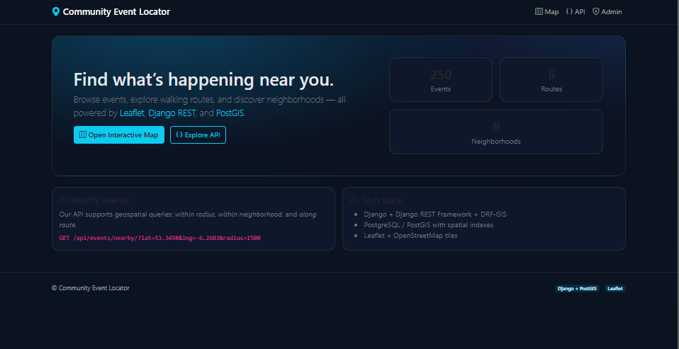
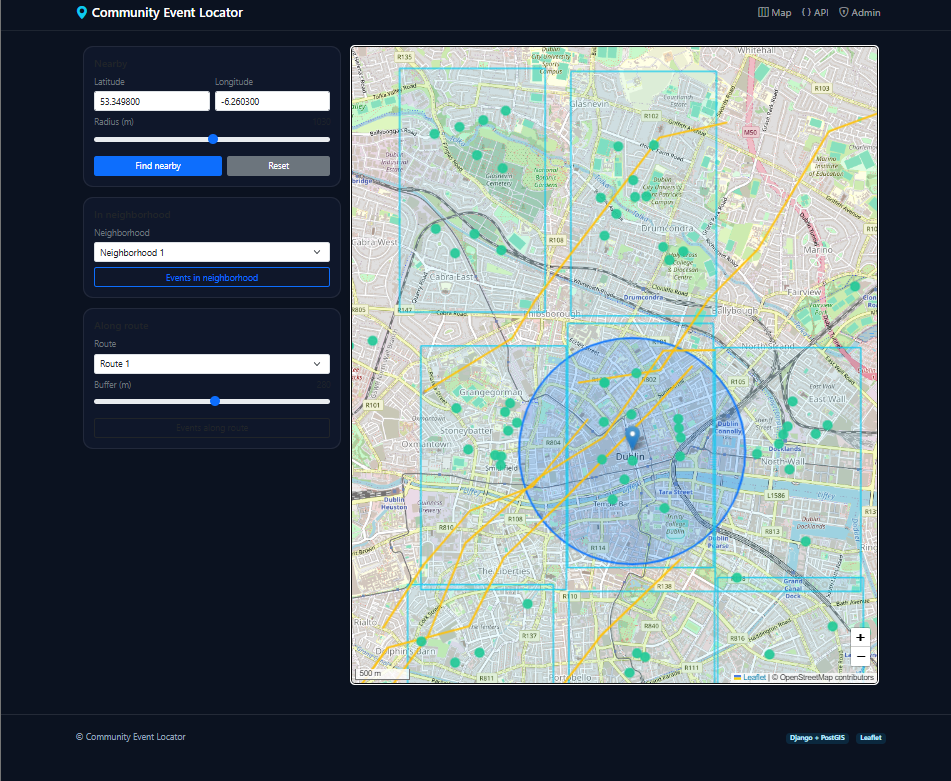
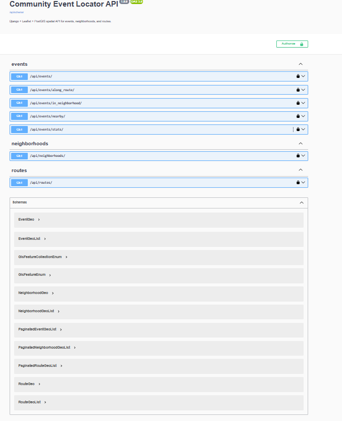
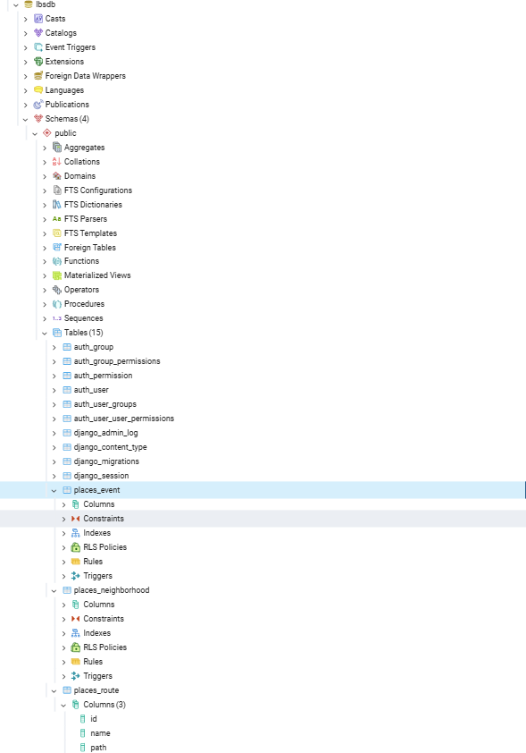
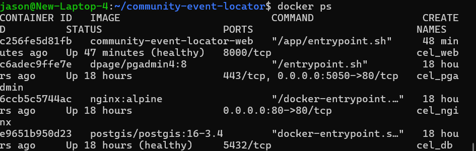

Community Event Locator

A small location-based web app to explore events, walking routes, and neighborhoods on an interactive map.
Stack: Django + DRF + PostGIS + Leaflet, served by Gunicorn behind Nginx, all in Docker.

Features

Spatial data: points (events), lines (routes), polygons (neighborhoods)

Real spatial queries:

Nearby: events within a radius of a lat/lng

In neighborhood: events contained by a polygon

Along route: events within a buffer of a route

Responsive Leaflet map UI

OpenAPI + Swagger / ReDoc with drf-spectacular

Production-style containerization: web (Gunicorn), PostGIS, Nginx, pgAdmin

Quick start (Docker)
# 1) Configure
cp .env.example .env

# 2) Build & run
docker compose build
docker compose up -d

Open:

App home: http://localhost/

Map UI: http://localhost/map/

API root: http://localhost/api/

Swagger: http://localhost/api/docs/

ReDoc: http://localhost/api/redoc/

Health: http://localhost/health/

pgAdmin: http://localhost:5050/
 (use PGADMIN_EMAIL / PGADMIN_PASSWORD from .env)

Importing local data (optional)

If you’ve got a local DB you want in Docker:

# from your host, dump local DB
pg_dump -h 127.0.0.1 -U postgres -d lbsdb -Fc -f local_lbsdb.dump

# copy into the db container & restore
docker cp local_lbsdb.dump cel_db:/tmp/local_lbsdb.dump
docker compose exec db bash -lc "pg_restore -U postgres -d lbsdb --clean --if-exists /tmp/local_lbsdb.dump"

Local development (without Docker)
python -m venv venv
source venv/bin/activate
pip install -r requirements.txt
cp .env.example .env    # point DB to your local Postgres
python manage.py migrate
python manage.py collectstatic --noinput
python manage.py runserver

Environment variables
Key	Purpose	Example
DJANGO_SECRET_KEY	Django secret	change-me
DJANGO_DEBUG	True/False	False
DJANGO_ALLOWED_HOSTS	CSV hosts	localhost,127.0.0.1,nginx,web
POSTGRES_DB	DB name	lbsdb
POSTGRES_USER	DB user	postgres
POSTGRES_PASSWORD	DB password	*******
POSTGRES_HOST	Host (Docker)	db
POSTGRES_PORT	Port	5432
PGADMIN_EMAIL	pgAdmin login	admin@example.com
PGADMIN_PASSWORD	pgAdmin login pwd	admin123

.env.example is included; do not commit a real .env.

API (cheatsheet)

All endpoints return proper GeoJSON.

Endpoint	Method	Params	Description
/api/events/	GET	q, ordering, bbox=minLng,minLat,maxLng,maxLat	Paginated Events list (search & ordering)
/api/events/nearby/	GET	lat, lng, radius (m)	Events within radius
/api/events/in_neighborhood/	GET	neighborhood_id	Events inside the neighborhood polygon
/api/events/along_route/	GET	route_id, buffer (m)	Events within buffer of route
/api/events/stats/	GET	—	Summary counts
/api/routes/	GET	q, ordering	All routes (FeatureCollection)
/api/neighborhoods/	GET	q, ordering	All neighborhoods (FeatureCollection)

Examples:

# Nearby
curl "http://localhost/api/events/nearby/?lat=53.3498&lng=-6.2603&radius=1500"

# In a neighborhood
curl "http://localhost/api/events/in_neighborhood/?neighborhood_id=1"

# Along a route
curl "http://localhost/api/events/along_route/?route_id=2&buffer=200"

Architecture
Browser ──► Nginx (reverse proxy) ──► Gunicorn (Django/DRF) ──► Postgres + PostGIS
           ▲                                                   │
           └────────────── Leaflet tiles from OpenStreetMap ──┘

Docker services: web, db (PostGIS), nginx, pgadmin.
Networks: frontend & backend. Volumes for DB, static, media.

Project structure (high-level)
places/
  models.py            # Event (Point), Route (LineString), Neighborhood (Polygon)
  serializers.py       # GeoJSON serializers
  views_api.py         # spatial endpoints (nearby/in_neighborhood/along_route)
templates/, static/    # UI (Leaflet)
config/settings.py     # DRF, drf-spectacular, CORS, PostGIS config
docker-compose.yml, Dockerfile, nginx/default.conf, entrypoint.sh

Security & accessibility notes

Secure headers enabled; cookies security flagged for production.

CORS restricted to API paths.

UI uses large tap targets, labels, and contrast friendly theme (aiming for WCAG 2.1 AA).

Troubleshooting

web can’t reach DB: ensure POSTGRES_PASSWORD matches .env; docker compose logs -f web db

CRLF in .env (Windows): sed -i 's/\r$//' .env

Swagger not loading: check DEBUG vs allowed hosts and SPECTACULAR_SETTINGS.

License & credits

Leaflet, OpenStreetMap tiles, PostGIS. Educational use.

Screenshots to include (save in docs/screenshots/ and reference below)

home.png – landing page with cards and counts
URL: http://localhost/

map.png – Leaflet map with blue radius overlay
URL: http://localhost/map/

swagger.png – Swagger UI listing endpoints
URL: http://localhost/api/docs/

pgadmin_tables.png – pgAdmin showing places_event, places_route, places_neighborhood tables and spatial indexes
pgAdmin → Servers → Docker_postgis → Databases → lbsdb → Schemas → public → Tables

docker_ps.png – terminal showing running containers (cel_web healthy, cel_db healthy, cel_nginx up)

(optional) nearby_curl.png – terminal with a curl GET to /api/events/nearby/ and JSON result.

## Screenshots

| | |
|---|---|
|  |  |
|  |  |
|  | 

